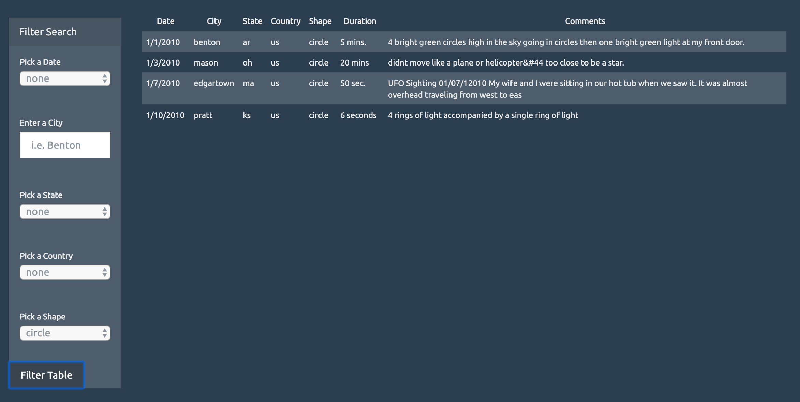

### Problem this analysis to trying to solve:
A company collected eye-witness reports of UFO sightings, and they want the information available online. However, the collection is too large to search through manually. The purpose of this project is to use JavaScript, HTML, CSS, and D3.js to create a dynamic table based upon the dataset of eye-witness reports. The table should also allow users to filter the data for specific values.

### How to run the code:
1. Run the URL https://sfroonjian.github.io/javascript-challenge/ in your browser. \n\n
**OR**
1. Save all of the files of the repository, except the files in the "screenshots" folder, to your computer.
1. Open the file, index.html, in your browser.
1. Play around with the filters on the left hand side of the webpage to view eye-witness reports of UFO sightings.

### Data collected:

### Why the data is displayed this way:
The data is displayed in a table so that users can easily view the date, city, state, country, shape, duration, and comments of each report. There is also a side bar on the left so users can filter different criteria, since there is a lot of data in the collection. Most of the filters are drop-down menus because there were either a limited amount of options for that category (ex. for date, state, and country) or users might not know what to type in for that category if there was a text box (ex. for shape).
